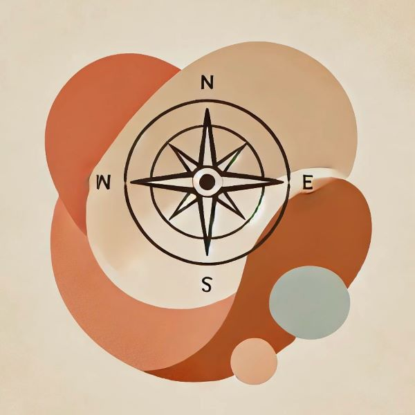

Czasem, gdy ktoś zadaje pytanie: „Co jest dla Ciebie naprawdę ważne?” zapada cisza. Bo skąd mamy to wiedzieć? Skąd mamy mieć gotową listę wartości, którymi chcemy kierować się w życiu? Może nigdy się nad tym nie zastanawialiśmy. Może tak długo podążaliśmy za tym, co „powinno” być ważne, co „ktoś nam wskazał za ważne”, że przestaliśmy słyszeć swój własny głos. <!--more--> 

Ale Kelly Wilson, współtwórca terapii ACT, mówi o tym inaczej:

„Jeśli ktoś nie wie, co jest dla niego ważne, to może samo pragnienie wiedzy o tym jest już wartością.”

Nawet jeśli w tej chwili nie masz jasności to nie znaczy, że jej nie znajdziesz. Samo to, że szukasz, zastanawiasz się, próbujesz to już ma znaczenie 🙂

<b>Wartości to nie cele.</b>

W ACT wartości są jak kompas. Nie są listą rzeczy do osiągnięcia, ale raczej kierunkiem, w którym chcemy podążać. Cel można odhaczyć i uznać za „zrealizowany”, a wartości są czymś co możemy wyrażać każdego dnia np. w naszych wyborach, działaniach, słowach.

Jeśli wartością jest życzliwość, to nie znaczy, że w którymś momencie można powiedzieć: „Okej, już wystarczająco często byłem życzliwy, koniec.” Jeśli wartością jest rozwój, to nie chodzi o zdobycie jednego dyplomu, ale o gotowość do uczenia się przez całe życie.

<b>Jak odkryć swoje wartości?</b>

Czasem pytanie „co jest dla mnie ważne?” wydaje się zbyt abstrakcyjne. Wtedy można spróbować inaczej:
*	Na kim Ci zależy? Kogo nie chciałbyś zawieść? Jaką osobą chcesz być dla bliskich?
*	Kiedy czujesz, że Twoje życie ma sens? Co sprawia, że czujesz się bardziej „sobą”?
*	Czego żałowałbyś na końcu życia? Czego chciał_byś mieć więcej, a co, gdyby zniknęło, nie zrobiłoby większej różnicy?
*	Co podziwiasz w innych ludziach? Jakie cechy czy postawy są dla Ciebie inspirujące?

Wartości nie są czymś, co trzeba znaleźć raz na zawsze. One mogą się zmieniać, dojrzewać, ewoluować razem z nami. To, co jest ważne dziś, może wyglądać inaczej za kilka lat i to jest w porządku 🙂

<b>Życie w zgodzie z wartościami.</b>

Odkrycie swoich wartości to jedno. Druga sprawa to życie w ich zgodzie. To codzienne, małe wybory, które sprawiają, że nawet jeśli droga jest pełna zakrętów i przeszkód, to nadal idziemy w kierunku, który ma dla nas znaczenie.

Nie zawsze jest to łatwe. Czasem życie w zgodzie z wartościami oznacza dyskomfort i mówienie „nie”, kiedy inni oczekują „tak”. Czasem to podejmowanie trudnych decyzji, mierzenie się z własnym strachem. Jednak jeśli wartości są kompasem, to może nie chodzi o to, żeby zawsze było łatwo, tylko o to, żeby wiedzieć, w którą stronę chcemy płynąć na tym naszym statku życia 🙂 

A jeśli w tej chwili nie wiesz? Jeśli to pytanie Cię przerasta? Może właśnie to pragnienie znalezienia odpowiedzi jest już wartością samą w sobie.