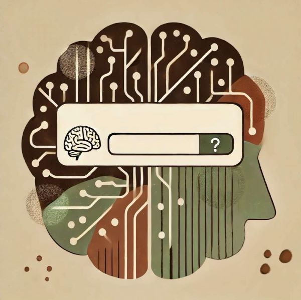

Wyobraź sobie, że Twój umysł działa jak algorytm wyszukiwarki internetowej. <!--more--> Kiedy wpisujesz w Google jakieś hasło, np. „Jak schudnąć?”, to pierwsze wyniki, które dostajesz, niekoniecznie są najbardziej rzetelne i często są po prostu tymi, które były najczęściej klikane przez innych albo są sponsorowane.

Tak samo działa nasz mózg. Nie „wyszukuje” myśli w oparciu o prawdę, ale o to, co było często powtarzane w naszym otoczeniu. Jeśli przez lata słyszałeś, że „otyłość = brak atrakcyjności”, to gdy przybierzesz na wadze, Twój umysł automatycznie „wyrzuci” myśl: „Jestem nieatrakcyjny” – nie dlatego, że to obiektywna prawda, ale dlatego, że ten schemat myślowy został powtarzany tak często, że znajduje się na „pierwszej stronie wyników”.

Podobnie, jeśli w społeczeństwie krąży przekonanie, że „Teraz wszyscy wymyślają sobie ADHD, a tak naprawdę to wszystko z lenistwa”, to gdy zauważysz u siebie jakieś trudności z koncentracją uwagi, nadpobudliwością i dostaniesz diagnozę ADHD, a i tak automatycznie możesz zacząć myśleć: „Jestem po prostu leniwy, to tylko wymysły, pewnie nie mam żadnego ADHD” – bo tak działa mechanizm skojarzeń.

Ale tak jak w Google możesz przewinąć dalej, wpisać inne hasło lub poszukać alternatywnych źródeł, tak samo możesz zacząć zauważać swoje myśli i to, że nie zawsze są one prawdą ostateczną.

Dlaczego niektóre myśli nigdy nie znikną?

Możesz pomyśleć: „Ok, to co mam zrobić, żeby te myśli już nigdy nie wróciły?”.

I tu dochodzimy do kolejnej cechy wyszukiwarek – raz zapisane treści nigdy nie znikają. Nawet jeśli przestaniesz klikać w dany temat, on i tak nadal istnieje w bazie danych. Tak samo działa nasz umysł. Jeśli jakaś myśl była dla Ciebie ważna, wywoływała emocje lub często się pojawiała, Twój mózg ją zapamięta – nawet jeśli nie chcesz do niej wracać.

Co więcej, im bardziej próbujesz NIE myśleć o czymś, tym bardziej Twój mózg to wyświetla. To jak wpisanie w Google „Nie pokazuj mi reklam butów” – nagle widzisz buty wszędzie.

Spróbuj teraz przez 10 sekund NIE myśleć o czekoladowych ciastkach.

…

I co? 😉

To samo dzieje się z myślami, których nie chcemy mieć. Jeśli ktoś powiedział Ci w dzieciństwie „Nie jesteś wystarczająco dobry”, to nawet jeśli później osiągniesz sukces, ta myśl może wracać – nie dlatego, że jest prawdziwa, ale dlatego, że Twój umysł kiedyś ją zapisał i uważa, że może być „przydatna”.

Co zamiast walki z myślami?

- Zauważ je, ale nie klikaj ~ Myśli to jak reklamy w internecie – możesz je widzieć, ale nie musisz w nie wchodzić. Jeśli Twój umysł podsuwa Ci „Jestem beznadziejny”, możesz powiedzieć: „O, moja wyszukiwarka znowu to podpowiada”, zamiast traktować to jako obiektywną prawdę.

- Nie walcz – pozwól im być ~ Skoro nie możemy całkowicie „usunąć” myśli, może warto nauczyć się z nimi żyć? Możesz pomyśleć o nich jak o hałasie w kawiarni – są w tle, ale nie musisz się na nich skupiać.

- Kieruj się wartościami, a nie automatycznymi skojarzeniami ~ Zamiast pytać „Czy moje myśli są prawdziwe?”, zapytaj: „Czy pomagają mi żyć tak, jak chcę?”. Może pojawić się w Twojej głowie myśl „Jestem nieatrakcyjny” i mimo to możesz iść na randkę, ponieważ ważne dla Ciebie są bliskość i relacje 🙂

Twój umysł to nie wyrocznia prawdy – to tylko algorytm wyszukiwarki, który podsuwa Ci najbardziej „klikalne” myśli. Niektóre z nich będą wracać przez całe życie, zwłaszcza jeśli kiedyś były dla Ciebie ważne. Ale nie musisz ich traktować jako obiektywną rzeczywistość – możesz nauczyć się patrzeć na nie z dystansem i kierować się tym, co naprawdę dla Ciebie ważne.

Dlaczego tak działa nasz umysł? Odpowiedzi dostarcza Teoria Ram Relacyjnych (RFT), która opisuje, jak nasz mózg uczy się poprzez powiązania i skojarzenia. To dzięki RFT wiemy, że myśli nie pojawiają się przypadkowo – są efektem naszych wcześniejszych doświadczeń i schematów. Ale o tym opowiem więcej w osobnym wpisie 🙂