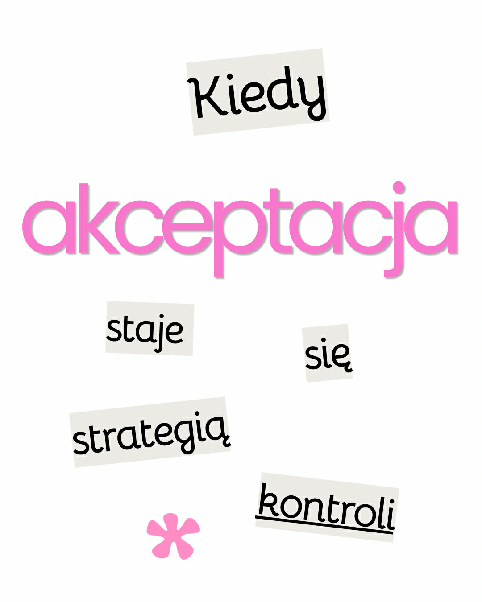

Terapia ACT (Acceptance and Commitment Therapy) uczy nas jednego z najbardziej kontrintuicyjnych podejść do ludzkiego cierpienia: zamiast walczyć z trudnymi emocjami, mamy zrobić dla nich miejsce. Akceptacja, obecność i gotowość do przeżywania tego, co trudne, stają się fundamentem zmiany. Problem zaczyna się wtedy, gdy… zaczynamy używać akceptacji po to, żeby przestać czuć. Brzmi paradoksalnie? Właśnie w tym tkwi sedno.
<!--more-->
### Akceptacja jako doświadczenie vs. akceptacja jako narzędzie

W swojej istocie akceptacja w ACT nie jest techniką służącą redukcji dyskomfortu. To postawa – świadome otwarcie się na doświadczenie takim, jakie jest, bez prób jego zmiany.

Jednak bardzo łatwo wpaść w subtelną pułapkę:

- „Zaakceptuję ten lęk, żeby zniknął.”
- „Pozwolę tej emocji być, żeby przestała mi przeszkadzać.”
- „Zastosuję ACT, żeby się nie stresować.”

W tym momencie akceptacja przestaje być akceptacją, a zaczyna być… strategią kontroli. Czyli dokładnie tym, od czego ACT próbuje nas uwolnić.

Skąd się bierze ta pułapka?

Jesteśmy biologicznie zaprogramowani do unikania bólu i maksymalizowania przyjemności. To naturalne, że chcemy „pozbyć się” trudnych stanów. Nawet kiedy uczymy się nowych podejść terapeutycznych, nasz umysł szybko próbuje włączyć je do starego schematu: kontroluj → unikaj → napraw.

ACT nie usuwa tej tendencji. Ono uczy ją zauważać. Dlatego moment, w którym zaczynasz myśleć: „Robię to dobrze, więc powinienem już czuć się lepiej” jest często sygnałem, że akceptacja została „przechwycona” przez mechanizm kontroli.

### Jak rozpoznać, że akceptacja stała się kontrolą? Kilka typowych sygnałów:

- Warunkowość – jesteś gotów doświadczać emocji tylko pod warunkiem, że coś się zmieni.
- Niecierpliwość – pojawia się frustracja, że „to nie działa”.
- Ukryty cel – Twoim prawdziwym celem jest pozbycie się dyskomfortu, nie jego przeżycie.
- Ocena doświadczenia – mimo deklarowanej akceptacji nadal klasyfikujesz emocje jako „złe” i „do usunięcia”.

W skrócie: nadal jesteś w relacji walki, tylko w bardziej wyrafinowanej formie ;>

### Czym w takim razie jest „prawdziwa” akceptacja?

Akceptacja w duchu ACT to gotowość do kontaktu z doświadczeniem bez gwarancji, że stanie się ono przyjemniejsze. To oznacza, że: 

- możesz czuć lęk i nadal działać zgodnie z wartościami
- możesz czuć smutek i nie próbować go naprawiać
- możesz być w dyskomforcie i nie traktować go jako problemu do rozwiązania.

Paradoks polega na tym, że kiedy przestajesz próbować kontrolować swoje doświadczenie, często ono rzeczywiście się zmienia. Ale to efekt uboczny - nie cel.

### Jak wrócić na właściwy tor?

Jeśli zauważysz, że używasz akceptacji jako strategii kontroli, nie oznacza to porażki.
To… piękny moment praktyki. Samo zauważenie będzie już dobrym kierunkiem :>

Możesz zadać sobie kilka pytań:

- „Czy próbuję coś teraz zmienić, czy naprawdę robię na to miejsce?”
- „Co bym zrobił, gdybym nie musiał się czuć lepiej?”
- „Czy mogę pozwolić tej emocji być, nawet jeśli zostanie na dłużej?”

I co najważniejsze: zauważ tę tendencję bez oceniania. Umysł robi to, do czego został zaprojektowany.

Akceptacja w ACT nie jest subtelną techniką kontroli emocji. Jest radykalną zmianą relacji z nimi. To przejście od: „Muszę się tego pozbyć”
do: „Mogę to unieść, mogę zrobić dla tego uczucia miejsce i żyć w zgodzie ze sobą”.